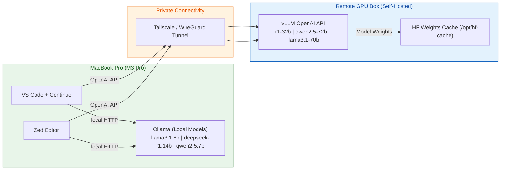

# Hybrid LLM Setup Guide (MacBook Pro + Remote GPU)

This guide explains how to set up a **local-first LLM environment on MacBook Pro (M3 Pro)** with **optional remote GPU burst** for heavy workloads.  
You’ll learn how to install, configure, and use models in **VS Code (Continue)** and **Zed**, while keeping costs predictable.

---

## 🟢 Step 1. Local Setup (MacBook Pro M3 Pro)

### 1. Install Ollama
```bash
brew install --cask ollama
launchctl kickstart -k gui/$(id -u)/ai.ollama
```
Docs → [Ollama Official](https://ollama.ai/docs)

### 2. Pull local models
```bash
ollama pull llama3.1:8b        # fast daily model
ollama pull deepseek-r1:14b    # reasoning
ollama pull qwen2.5:7b         # code helper
# optional (heavy, slow on 18GB): 
ollama pull deepseek-coder:33b
```

### 3. Test Ollama
```bash
ollama run llama3.1:8b "2+2?"
```

---

## 🔵 Step 2. Editor Integration

### A. Continue.dev (VS Code)
- Install [Continue Extension](https://marketplace.visualstudio.com/items?itemName=Continue.continue)  
- Open config: `Cmd+Shift+P → Continue: Open Config`

`~/.continue/config.yaml`:
```yaml
models:
  - name: Local R1
    provider: ollama
    model: deepseek-r1:14b
  - name: Llama Local
    provider: ollama
    model: llama3.1:8b
  - name: Qwen Local
    provider: ollama
    model: qwen2.5:7b

slashCommands:
  - name: explain-bug
    prompt: |
      Think step by step across selected files.
      Identify the bug, propose a minimal diff,
      and give a failing + passing test.
```
Docs → [Continue.dev Setup](https://docs.continue.dev/getting-started)

---

### B. Zed Editor
- Open `settings.json` → add:

```json
{
  "language_models": {
    "openai_compatible": {
      "Ollama Local": {
        "api_url": "http://localhost:11434/v1",
        "available_models": [
          { "name": "llama3.1:8b", "display_name": "Llama 3.1 8B" },
          { "name": "deepseek-r1:14b", "display_name": "DeepSeek R1 14B" },
          { "name": "qwen2.5:7b", "display_name": "Qwen 2.5 7B" }
        ]
      }
    }
  }
}
```
Docs → [Zed AI Config](https://zed.dev/docs/ai)

---

## 🟣 Step 3. Remote GPU Box (when needed)

### 1. Rent a GPU (RunPod, Lambda Labs, Paperspace, AWS, GCP)
- **4090 (24 GB)** → 32B, 70B quantized  
- **A100 80 GB** → full 70B precision

### 2. Install vLLM (OpenAI API server)
```bash
docker run --gpus all -p 8000:8000   vllm/vllm-openai:latest   --model deepseek-ai/DeepSeek-R1-Distill-Qwen-32B   --max-model-len 32768
```
Docs → [vLLM OpenAI Server](https://docs.vllm.ai/en/latest/serving/openai_compatible_server.html)

### 3. Connect Securely
- Install [Tailscale](https://tailscale.com/download) on Mac + GPU box.  
- Use tailnet IP → `http://100.x.y.z:8000/v1`.

### 4. Add Remote to Editors

**Continue.yaml**
```yaml
- name: R1 Remote
  provider: openai
  apiBase: http://100.x.y.z:8000/v1
  apiKey: dummy
  model: r1-32b
```

**Zed settings.json**
```json
{
  "language_models": {
    "openai_compatible": {
      "R1 Remote": {
        "api_url": "http://100.x.y.z:8000/v1",
        "available_models": [
          { "name": "r1-32b", "display_name": "DeepSeek R1 32B" }
        ]
      }
    }
  }
}
```

---

## 🔴 Step 4. Daily Workflow

- **Default:** Use local (Llama 3.1 8B / R1 14B).  
- **Escalate:** Switch to GPU box only for:  
  - Large repos / multi-file bug hunts.  
  - Long context (>8k tokens).  
  - Heavy refactors (Qwen 72B).  

💰 Local = Free  
💰 GPU = ~₹75/hr (4090), ₹250/hr (A100)  

---

# 📖 Learning Materials

### 🔹 LLM Fundamentals
- [The Illustrated Transformer](https://jalammar.github.io/illustrated-transformer/)  
- [HuggingFace Course](https://huggingface.co/course/chapter1)  
- [Lil’Log LLM Notes](https://lilianweng.github.io/posts/)  

### 🔹 Serving & Infra
- [Ollama Docs](https://ollama.ai/docs)  
- [vLLM Docs](https://docs.vllm.ai)  
- [RunPod GPU Setup Guide](https://docs.runpod.io/docs)  

### 🔹 Editor Integrations
- [Continue.dev](https://docs.continue.dev)  
- [Zed AI Setup](https://zed.dev/docs/ai)  

### 🔹 Prompting & Debugging
- [Prompt Engineering Guide](https://www.promptingguide.ai/)  
- [LangChain Docs](https://python.langchain.com) (for advanced orchestration)  

---

# ✅ Summary

- Local Mac runs **8B–14B models** daily → free.  
- Remote GPU runs **32B–70B models** only when needed → saves cost.  
- Editors (VS Code + Zed) see both local and remote as **OpenAI-compatible endpoints**.  
- Setup takes **<1 hr total**, most time = downloading models.  
- Budget stays ~₹4.5k/month with spikes in heavy months.  

---

## 🗺️ Architecture Diagram (Mermaid)



## 🚀 Next Steps

1. **First Run**: Start with local models
   ```bash
   ollama pull llama3.1:8b
   ```

2. **Test Remote**: Verify GPU connection
   ```bash
   curl http://100.x.y.z:8000/v1/models -H "Authorization: Bearer dummy"
   ```

3. **Save Configs**: Backup your editor configs to version control

---

## 🛠 Troubleshooting

### Common Issues
- **Ollama not starting**: Try `killall ollama` then restart
- **Connection refused**: Check if VPN is active
- **Out of memory**: Reduce context length or use smaller models

### Performance Tips
- Use `--num_gpu 2` for multi-GPU setups
- Enable `tensor_parallel_size` for larger models
- Monitor GPU usage with `nvidia-smi`
