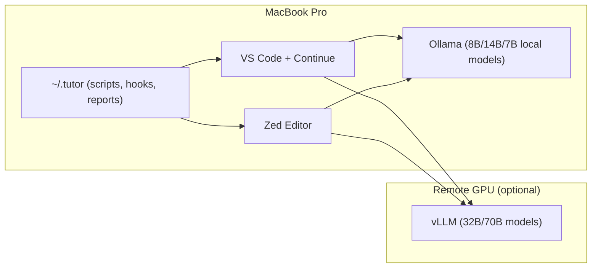

# Build-From-Scratch Guide
## Hybrid Local-First LLM + Global Coding Tutor (JS, Java, Python, C/C++)

This guide helps you build **from scratch**:
1. A **local-first hybrid LLM setup** (MacBook Pro M3 Pro) with optional **self-hosted remote GPU**.
2. A **global coding tutor** that enforces **language + architectural best practices** and generates a **weekly report**.

---

## Part A — Local‑First Hybrid LLM Setup

### A1) Install Ollama
```bash
brew install --cask ollama
launchctl kickstart -k gui/$(id -u)/ai.ollama
```

### A2) Pull local models
```bash
ollama pull llama3.1:8b
ollama pull deepseek-r1:14b
ollama pull qwen2.5:7b
# Optional heavy
ollama pull deepseek-coder:33b
```

### A3) Editor Integration

**Continue (VS Code)** — `~/.continue/config.yaml`:
```yaml
models:
  - name: R1 Local
    provider: ollama
    model: deepseek-r1:14b
  - name: Llama Local
    provider: ollama
    model: llama3.1:8b
  - name: Qwen Local
    provider: ollama
    model: qwen2.5:7b
```

**Zed** — `settings.json`:
```json
{
  "language_models": {
    "openai_compatible": {
      "Ollama Local": {
        "api_url": "http://localhost:11434/v1",
        "available_models": [
          { "name": "llama3.1:8b", "display_name": "Llama 3.1 8B" },
          { "name": "deepseek-r1:14b", "display_name": "DeepSeek R1 14B" },
          { "name": "qwen2.5:7b", "display_name": "Qwen 2.5 7B" }
        ]
      }
    }
  }
}
```

### A4) Optional Remote GPU Box
```bash
docker run --gpus all -p 8000:8000 vllm/vllm-openai:latest   --model deepseek-ai/DeepSeek-R1-Distill-Qwen-32B   --max-model-len 32768
```

---

## Part B — Global Coding Tutor

### B1) Global Home
```bash
mkdir -p ~/.tutor/{scripts,prompts,rules,reports,skills,hooks,config}
```

### B2) Style Config
`~/.tutor/config/.editorconfig`, `.prettierrc.json`, `.clang-format` → enforce consistent formatting.

### B3) Tools
```bash
npm i -g eslint typescript depcruise jest
pipx install ruff mypy pytest import-linter radon
brew install spotbugs cppcheck clang-format llvm include-what-you-use
```

### B4) Global Scan Script
`~/.tutor/scripts/scan.sh` → run eslint/tsc/jest, ruff/mypy/pytest, spotbugs/checkstyle, cppcheck/clang-tidy.

### B5) Learning + Report Scripts
- `learn.py` → logs commit data into `~/.tutor/skills/learning.jsonl`
- `report.py` → generates weekly summary in `~/.tutor/reports/weekly.md`

### B6) Global Git Hooks
```bash
git config --global core.hooksPath ~/.tutor/hooks
```
- `pre-commit`: runs scan.sh  
- `post-commit`: runs learn.py  

### B7) Tutor CLI
`~/.tutor/tutor`:
```bash
#!/usr/bin/env bash
case "${1:-}" in
  scan) ~/.tutor/scripts/scan.sh ;;
  learn) python3 ~/.tutor/scripts/learn.py ;;
  report|weekly) python3 ~/.tutor/scripts/report.py && open ~/.tutor/reports/weekly.md ;;
  *) echo "Usage: tutor {scan|learn|report}" ;;
esac
```

---

## Part C — Coaching Prompts

### Continue Slash Commands
- `/coach`: explain issue, suggest diff, better names, reduce complexity, add tests, one takeaway.
- `/lang-best-practices`: enforce JS/Py/Java/C++ idioms.
- `/arch-review`: check architectural layer + dependency violations.

---

## Part D — Best Practices Enforced

- **JavaScript/TS**: immutability, async/await, validation at edges, dependency-cruiser layering.
- **Python**: EAFP, typing, pytest, import-linter for layering.
- **Java**: SOLID, Optional usage, ArchUnit for package rules.
- **C/C++**: RAII, const-correctness, smart pointers, clang-tidy, cppcheck.

**Architecture (all):** clean layering (app → domain → infra), bounded contexts, contracts at boundaries.

---

## Part E — Daily Flow

1. Code in any repo.  
2. Select code → `/coach` for guidance.  
3. `git commit` → hooks run scans & log learning.  
4. `tutor weekly` → generate global report.  
5. Heavy reasoning? → spin up remote GPU box.  

---

## Part F — Mermaid Diagram



---

## Quick Commands

```bash
# Run scan manually
tutor scan

# Generate weekly report
tutor weekly

# Check local models
ollama list
```

---

## ✅ Summary
- Local-first setup with Ollama models (fast + private).  
- Remote GPU only when needed.  
- Global tutor enforces style, best practices, and architecture across all repos.  
- Weekly report shows progress and recurring mistakes.  
